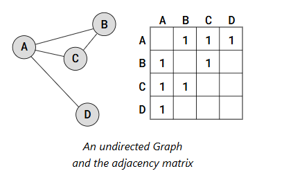
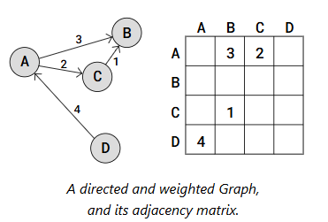
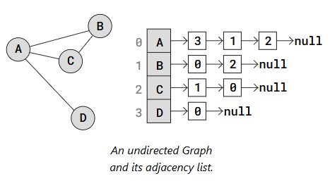
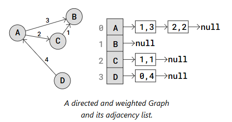

Graphs

## Properties:

Directed (digraph): Connections from a Node to another have a direction, aka vertex pairs have a direction. They can represent hierarchy or flow.
Cyclic: 
    Non Directed: Starting at a node and returning to it is possible without using an edge more than once
    Directed: Starting at a node and returning to it is possible
Connected: All vertices are connected through edges somehow. A non connected grahp is a graph with isolated (disjoint) subgraphs, or single isolated vertices
Loop (self-loop): A node has a path to itself. A node has an edge that starts and ends in itself. It makes a graph cyclic.
Weighted: Nodes/Vertices have weights (values). They can represent things like distance, capacity, time, probability, etc.

## Representations

#### Adjacency Matrix Graph Representation

Its a 2D array where each cell on index (i,j), stores information about the edge from vertix i to vertix j.

Note that the values in the matrix are symmetrical because the edges are undirected, which means A <-> B, so if matrix[0] is A and matrix[1] is B, both matrix[0][1] and matrix[1][0] need to be set.

To make it directed, decide where the value is set. E.g: If A -> B, set only at matrix[0][1]

To make it weighted, add the values in the correct positions instead of just 0 and 1.

#### Adjacency List Graph Representation

Used when the graph is sparse with many vertices. 
A sparse graph is a graph where each vertex only has edges to a small portion of the of the other vertices in the graph.

An Adjacency List has an array with all the vertices in the graph, and each position of the array has a linked list or another array with the vertex's edges.

Each vertex in the Array has a pointer to a Linked List that represents that vertex's edges. More specifically, the Linked List contains the indexes to the adjacent (neighbor) vertices.
So for example, vertex A has a link to a Linked List with values 3, 1, and 2. These values are the indexes to A's adjacent vertices D, B, and C.

An Adjacency List can also represent a directed and weighted Graph, like this:

Each vertex has a linkedlist with edges stored as i,w, with i being the index of the vertex and w being the weight of the edge

## Traversal

To traverse a graph, start in one vertex, go along the edges of that vertex visiting other vertices, until all vertices, or has many as possible have been visited.

#### DFS

#### BFS